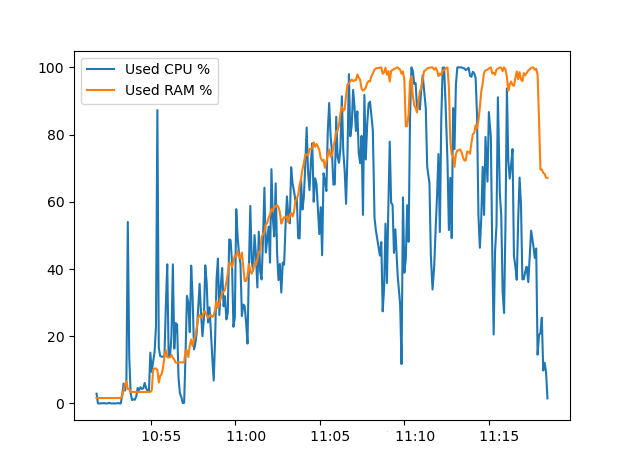
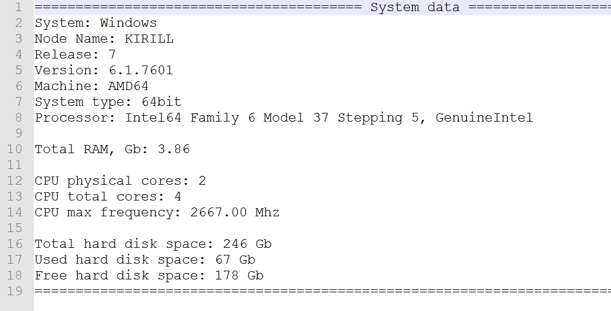

# How to pick data about the system

**On server side:**

1. Put file ```pick_metrics.py``` on server, where data will be picked.

2. Execute ```chmod a+x pick_metrics.py```

3. Run script: ```./pick_metrics.py 60```,
where 60 means minutes, when script picks data about (% of CPU and RAM load).
(```pick_metrics.py``` can be also ran on server from local machine).
---

**Locally:**

1. Edit file ```config.ini```

2. For Linux: run ```run_metrics.sh``` (for Windows: run ```run_metrics.bat```),
that runs ```pick_metrics.py``` on the server side.
```pick_metrics.py``` picks data about the system, writes it to txt and csv files.

3. For Linux: run ```make_report.sh``` (for Windows: run ```make_report.bat```).
It will launch scripts, that pick reports from the server and visualize them (every 10 secs).
---
**Reports examples:**



